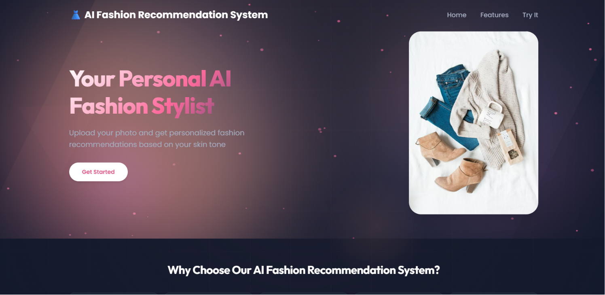
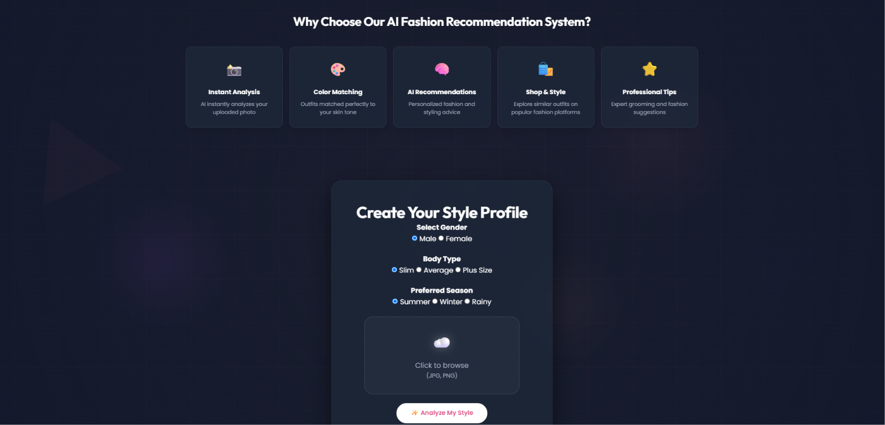
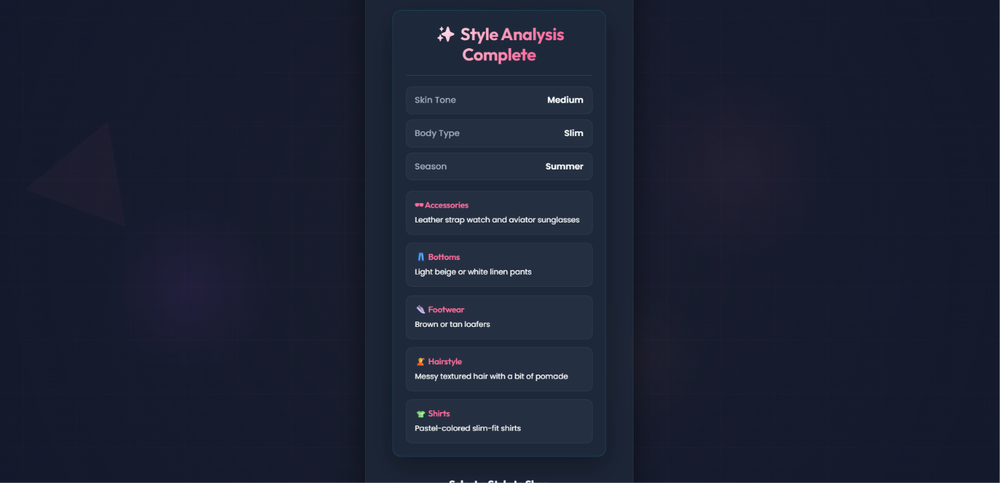

# 👗 AI Fashion Recommendation System

<p align="center">


</p>

<p align="center">
An AI-powered web application that analyzes user photos using Computer Vision and Artificial Intelligence to provide personalized fashion recommendations with direct shopping integration.
</p>

---

# 📖 Overview

**AI Fashion Recommendation System** is an intelligent fashion assistant developed using **Flask**, **OpenCV**, and **Groq Llama 3.3**.

The application analyzes an uploaded image, detects the user's skin tone, and generates personalized fashion recommendations based on:

- 🎨 Skin Tone
- 👤 Gender
- 👕 Body Type
- 🌦 Preferred Season

The AI suggests clothing, footwear, accessories, and hairstyles, then allows users to shop similar products directly from **Amazon**, **Myntra**, or **Flipkart**.

---

# ✨ Features

- 📸 Upload a photo
- 🤖 AI-powered fashion recommendations
- 👤 Human face detection using OpenCV
- 🎨 Automatic skin tone detection
- 👕 Shirt recommendations
- 👖 Bottom wear suggestions
- 👟 Footwear recommendations
- ⌚ Accessories suggestions
- 💇 Hairstyle recommendations
- 🌦 Season-based outfit recommendations
- 🛍 Shopping platform integration
- ⚡ Beautiful animated UI
- 📱 Responsive design
- 🎯 Easy-to-use interface

---

# 🛍 Shopping Platform Integration

After generating personalized fashion recommendations, users can instantly explore similar outfits on their preferred shopping platform.

| Platform | Description |
|----------|-------------|
| 🛒 Amazon | Browse a wide range of fashion products |
| 👗 Myntra | Explore branded and trending fashion |
| 🛍 Flipkart | Discover affordable clothing collections |

The application automatically redirects users to the selected platform with relevant fashion searches.

---

# 📸 Project Screenshots

## 🏠 Home Page



---

## 📤 Upload Image



---

## 🤖 AI Fashion Analysis



---

## 🛒 Shopping Platform Selection

Users can choose their preferred shopping platform.


---

## 🛒 Amazon Search Results


---

## 👗 Myntra Search Results


---

## 🛍 Flipkart Search Results


---

# 🔄 System Workflow

```text
User Uploads Image
        │
        ▼
Human Face Detection (OpenCV)
        │
        ▼
Skin Tone Detection
        │
        ▼
User Preferences
(Gender • Body Type • Season)
        │
        ▼
Groq Llama 3.3 AI
        │
        ▼
Generate Personalized Fashion Recommendations
        │
        ▼
Display Outfit Suggestions
        │
        ▼
Redirect to Amazon / Myntra / Flipkart
```

---

# 🛠 Tech Stack

## Frontend

- HTML5
- CSS3
- JavaScript

## Backend

- Python
- Flask
- Flask-CORS

## Artificial Intelligence

- Groq API
- Llama 3.3 70B
- OpenCV
- NumPy

## Other Libraries

- python-dotenv

---

# 📂 Project Structure

```text
AI-Fashion-Recommendation-System
│
├── app.py
├── requirements.txt
├── runtime.txt
├── Procfile
├── README.md
├── .gitignore
│
├── assets
│   ├── home.png
│   ├── upload.png
│   ├── analysis.png
│   ├── shopping.png
│   ├── amazon-results.png
│   ├── myntra-results.png
│   └── flipkart-results.png
│
├── static
│   ├── css
│   │   └── style.css
│   ├── js
│   │   └── script.js
│   ├── images
│   ├── dresses
│   └── uploads
│
└── templates
    └── index.html
```

---

# ⚙️ Installation

## 1. Clone the Repository

```bash
git clone https://github.com/badigevamshi/AI-Fashion-Recommendation-System.git
```

```bash
cd AI-Fashion-Recommendation-System
```

---

## 2. Install Dependencies

```bash
pip install -r requirements.txt
```

---

## 3. Create a `.env` File

```env
GROQ_API_KEY=your_groq_api_key_here
```

---

## 4. Run the Application

```bash
python app.py
```

---

## 5. Open Your Browser

```
http://127.0.0.1:5000
```

---

# 🚀 Future Enhancements

- 👔 AI Face Shape Detection
- 🧍 AI Body Shape Detection
- 👕 Virtual Try-On
- 🎨 AI Outfit Generation
- 👗 Smart Wardrobe Management
- ❤️ Save Favorite Outfits
- 📈 Fashion Trend Prediction
- 📱 Mobile Application

---

# 🎯 Key Highlights

- ✅ Human Face Verification
- ✅ Computer Vision Powered
- ✅ AI-Based Fashion Recommendations
- ✅ Personalized Outfit Suggestions
- ✅ Skin Tone Analysis
- ✅ Shopping Platform Integration
- ✅ Modern Glassmorphism UI
- ✅ Responsive Design
- ✅ Interactive User Experience

---

# 🤝 Contributing

Contributions are welcome!

1. Fork the repository.
2. Create a feature branch.
3. Commit your changes.
4. Push your branch.
5. Open a Pull Request.

---

# 👨‍💻 Author

## **B. Vamshi**

**B.Tech – Computer Science (Data Science)**

🔗 **GitHub:** https://github.com/badigevamshi

🔗 **LinkedIn:** https://www.linkedin.com/in/vamshi-badige

---

# ⭐ Support

If you found this project useful, please consider giving it a ⭐ on GitHub.

Your support motivates future improvements and helps the project reach more developers.