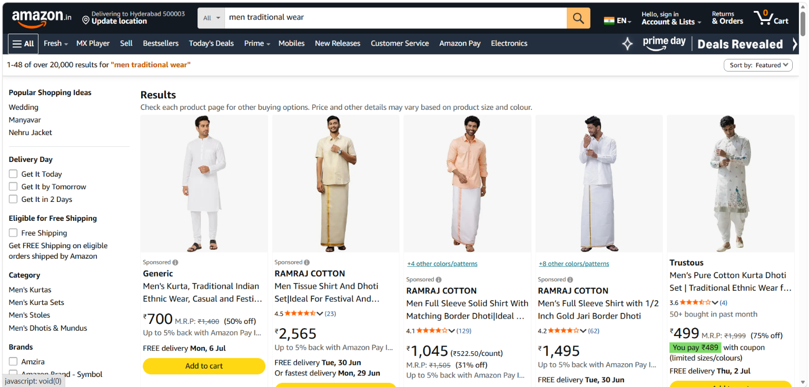
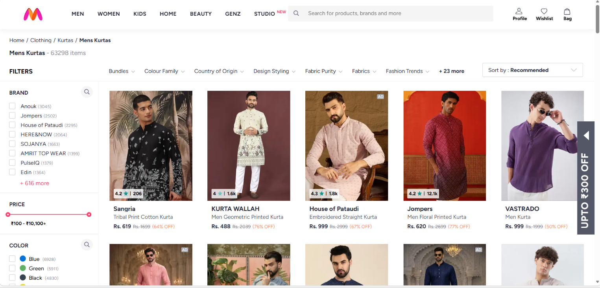
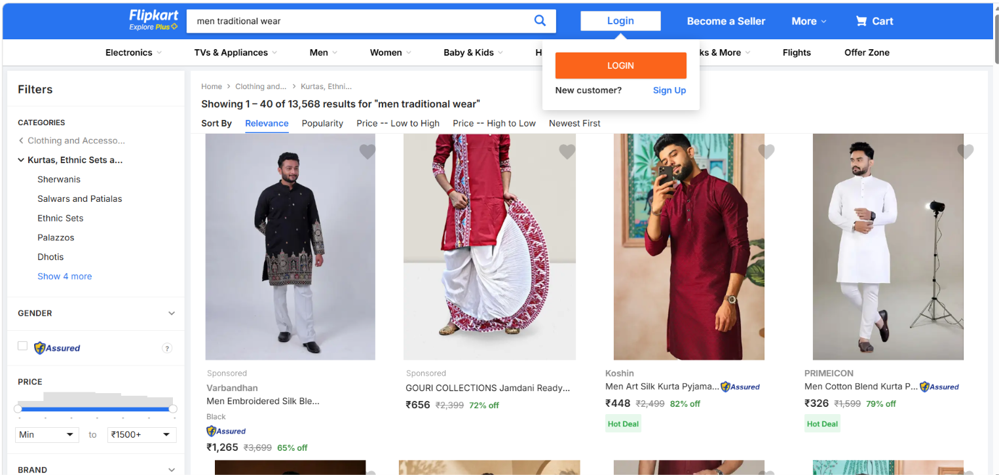

# 👗 AI Fashion Recommendation System

<p align="center">


</p>

<p align="center">
An AI-powered Fashion Recommendation Web Application that analyzes user images using Computer Vision and Artificial Intelligence to generate personalized outfit suggestions with direct shopping integration.
</p>

---

# 📑 Table of Contents

* Overview
* Features
* Shopping Platform Integration
* Project Screenshots
* System Workflow
* Tech Stack
* Project Structure
* Installation
* Future Enhancements
* Key Highlights
* Contributing
* Author
* License

---

# 📖 Overview

The **AI Fashion Recommendation System** is an intelligent web application developed using **Flask**, **OpenCV**, and **Groq Llama 3.3**.

The application analyzes an uploaded image, verifies the presence of a human face, detects the user's skin tone, and generates personalized fashion recommendations based on:

* 🎨 Skin Tone
* 👤 Gender
* 👕 Body Type
* 🌦 Preferred Season

Using **Groq Llama 3.3**, the application recommends:

* Shirts
* Bottom Wear
* Footwear
* Accessories
* Hairstyles

Users can then instantly browse similar products on popular shopping platforms such as **Amazon**, **Myntra**, and **Flipkart**.

---

# ✨ Features

* 📸 Upload an image
* 🤖 AI-powered fashion recommendations
* 👤 Human face verification using OpenCV
* 🎨 Automatic skin tone detection
* 👕 Personalized shirt recommendations
* 👖 Bottom wear suggestions
* 👟 Footwear recommendations
* ⌚ Accessories suggestions
* 💇 Hairstyle recommendations
* 🌦 Season-based outfit recommendations
* 🛍 Shopping platform integration
* ⚡ Interactive animations
* 🎯 Modern Glassmorphism UI
* 📱 Fully responsive design

---

# 🛍 Shopping Platform Integration

After generating personalized outfit recommendations, users can instantly browse similar products from their preferred shopping platform.

| Platform    | Description                             |
| ----------- | --------------------------------------- |
| 🛒 Amazon   | Search a wide range of fashion products |
| 👗 Myntra   | Explore branded and trending fashion    |
| 🛍 Flipkart | Browse affordable clothing collections  |

The application automatically redirects users to the selected shopping platform using relevant fashion search queries.

---

# 📸 Project Screenshots

## 🏠 Home Page


---

## 📤 Upload Page


---

## 🤖 AI Style Analysis


---

## 🛒 Shopping Platform Selection


---

## 🛍 Amazon Results



---

## 👗 Myntra Results



---

## 🛒 Flipkart Results



---

# 🔄 System Workflow

```text
User Uploads Image
        │
        ▼
Human Face Detection (OpenCV)
        │
        ▼
Skin Tone Detection
        │
        ▼
User Preferences
(Gender • Body Type • Season)
        │
        ▼
Groq Llama 3.3 AI
        │
        ▼
Generate Personalized Fashion Recommendations
        │
        ▼
Display Outfit Suggestions
        │
        ▼
Redirect to Amazon / Myntra / Flipkart
```

---

# 🛠 Tech Stack

## Frontend

* HTML5
* CSS3
* JavaScript

## Backend

* Python
* Flask
* Flask-CORS

## Artificial Intelligence

* Groq API
* Llama 3.3 70B
* OpenCV
* NumPy

## Other Libraries

* python-dotenv

---

# 📂 Project Structure

```text
AI-Fashion-Recommendation-System
│
├── app.py
├── requirements.txt
├── runtime.txt
├── Procfile
├── README.md
├── .gitignore
│
├── assets
│   ├── home-page.png
│   ├── upload-page.png
│   ├── style-analysis.png
│   ├── shopping-platforms.png
│   ├── amazon-results.png
│   ├── myntra-results.png
│   └── flipkart-results.png
│
├── static
│   ├── css
│   │   └── style.css
│   ├── js
│   │   └── script.js
│   ├── images
│   ├── dresses
│   └── uploads
│
└── templates
    └── index.html
```

---

# ⚙️ Installation

## 1. Clone the Repository

```bash
git clone https://github.com/badigevamshi/AI-Fashion-Recommendation-System.git
```

```bash
cd AI-Fashion-Recommendation-System
```

---

## 2. Install Dependencies

```bash
pip install -r requirements.txt
```

---

## 3. Create a `.env` File

```env
GROQ_API_KEY=your_groq_api_key_here
```

---

## 4. Run the Application

```bash
python app.py
```

---

## 5. Open Your Browser

```
http://127.0.0.1:5000
```

---

# 🚀 Future Enhancements

* 👔 AI Face Shape Detection
* 🧍 AI Body Shape Detection
* 👕 Virtual Try-On
* 🎨 AI Outfit Generation
* 👗 Smart Wardrobe Management
* ❤️ Save Favorite Outfits
* 📈 Fashion Trend Prediction
* 📱 Mobile Application

---

# 🎯 Key Highlights

* ✅ Human Face Verification
* ✅ Computer Vision Powered
* ✅ AI-Based Fashion Recommendations
* ✅ Personalized Outfit Suggestions
* ✅ Skin Tone Analysis
* ✅ Shopping Platform Integration
* ✅ Modern Glassmorphism User Interface
* ✅ Responsive Design
* ✅ Interactive User Experience

---

# 🤝 Contributing

Contributions are welcome!

1. Fork the repository.
2. Create a new feature branch.
3. Commit your changes.
4. Push the branch.
5. Open a Pull Request.

---

# 👨‍💻 Author

## **B. Vamshi**

**B.Tech – Computer Science (Data Science)**

* GitHub: https://github.com/badigevamshi
* LinkedIn: https://www.linkedin.com/in/vamshi-badige

---

# 📄 License

This project is intended for educational and portfolio purposes.

---

# ⭐ Support

If you found this project useful, please consider giving it a ⭐ on GitHub.

Your support motivates future improvements and helps the project reach more developers.
